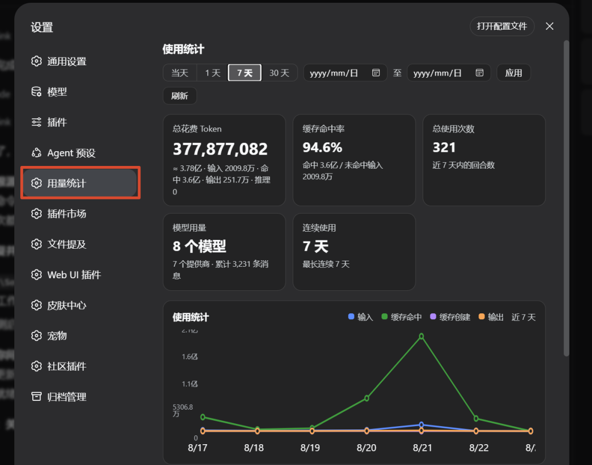
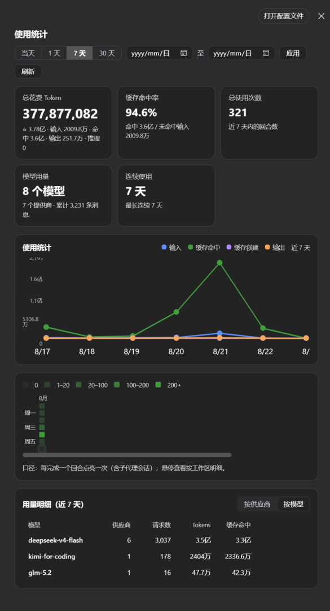

# dsh-shanhai-stats

DeepSeek Harness 用量统计插件（山海紫穹系列）。

在 DSH 的设置 → 用量统计 中提供四个板块：



- **总量汇总徽章** — 总花费 Token、缓存命中率、总使用次数、总请求次数、模型用量、连续使用天数；默认进入页面即为「当天」视图
- **每日走势折线图** — 按天展示输入 / 缓存命中 / 缓存写入 / 输出四段 Token 走势（可切 当天 / 1 / 7 / 30 天）
- **GitHub 风格热力图** — 近一年每日活动热度，悬停查看明细
- **用量明细表** — 支持「按供应商 / 按模型」两个标签页切换，查看各供应商或各模型的 Token 用量、消息数、缓存命中



## 特性

- 数据来自 DSH 会话日志的 `assistant/message` 事件（`usage` + `message.source.provider/model`），**插件自身不计算 token**，只做聚合与展示
- 口径与 DSH 一致：`inputTokens` = 未命中缓存的输入，`cacheReadTokens` = 缓存命中输入，`cacheWriteTokens` = 缓存写入；`outputTokens` 已含 `reasoningTokens`（展示时不再重复累加）
- 时间维度：全量 `totals` / `perWorkspace` / `perModel` 永不清零；按天明细保留 **53 周滑动窗口**，窗口外只进总数
- 历史回填：插件激活时扫描全部工作区会话；此后通过实时事件增量折叠（`seq` 断点续扫 + gap 检测补读）
- 支持子代理会话（随事件自然计入）
- 深浅色主题自适应（使用 DSW 设计变量）

## 安装

### 方式一：插件命令（推荐）

```bash
dsh plugin --profile web add github:cn-zhangpeng/dsh-shanhai-stats
```

> 锁定版本安装（更安全，推荐生产环境）：
> ```bash
> dsh plugin --profile web add github:cn-zhangpeng/dsh-shanhai-stats#v1.1.1
> ```

更新 / 卸载：

```bash
dsh plugin --profile web update dsh-shanhai-stats
dsh plugin --profile web remove dsh-shanhai-stats
```

### 方式二：手动部署 / 本地调试

1. 将本目录软链接（junction）到你的 DSH 插件目录；
2. 用 `cordis.patch.yml` 以覆盖层方式启动 Web UI：

   ```bash
   pnpm dsh web --patch ./cordis.patch.yml
   ```

3. 打开 DSH web 界面，在 设置 → 用量统计 查看；页面默认展示「当天」数据，也可切换 1 / 7 / 30 天或自定义范围。

> 参考官方文档：[第一个插件](https://deepseek-harness.github.io/deepseek-harness/develop/basic/)
> 首次启用会扫描本地历史会话（进度见页面提示），扫描完成后数字不再频繁变化。

## 架构

```
Host 半（Cordis 插件，lib/index.js）
  sessionQuery / workspaceRegistry 注入
  → baseline 扫描历史会话（按 cwd 归属工作区）
  → 实时 session/event 增量折叠
  → 内存聚合：totals / perWorkspace / perModel / byDay(53周)
  → /api/shanhai-stats HTTP 接口

Client 半（浏览器 bundle，lib/client.js）
  React.createElement 渲染（timer 注入，2s/15s 轮询）
  → 徽章 / 折线图 / 热力图 / 用量明细表
```

按 provider × model 新增 `perModel` 聚合维度，聚焦纯用量统计。

## 数据口径说明

| 维度 | 说明 |
|---|---|
| 总花费 Token | `input + output + cacheRead + cacheWrite + reasoning`（展示口径，缓存命中与计费价不同） |
| 缓存命中率 | `cacheRead / (input + cacheRead) × 100%` |
| 回合数 | `turn/end` 事件计数（含子代理会话） |
| 请求次数 | 带 `usage` 的 `assistant/message` 事件计数（与模型的一次往返 = 1 次），按 `kind: model` 才计入 |
| 热力图分档 | 按当天请求数：`0` / `1–50` / `50–200` / `200–500` / `500+` |
| 按天窗口 | 最近 53 周；更早历史只进全量 totals/按工作区/按模型，不进热力图与按天折线图 |

## 目录

```
dsh-shanhai-stats/
  package.json        # 插件元信息与打包配置
  cordis.patch.yml    # 插件注册补丁
  lib/index.js        # Host 半：聚合 + HTTP 接口
  lib/client.js       # Client 半：CC Switch 风格 UI
  test/               # host 端到端 + client smoke 测试
```

## 开发

```bash
node --check lib/index.js
node --check lib/client.js
node test/host-test.mjs     # 模拟 DSH 环境端到端验证聚合
node test/client-smoke.mjs  # 验证浏览器模块工厂可加载
```

## License

MIT